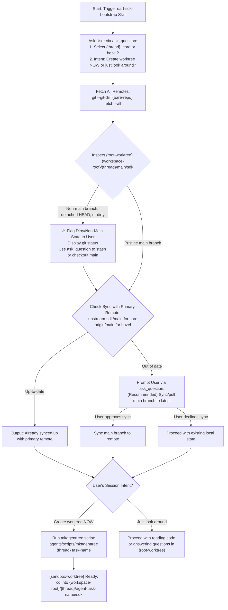

# Dart SDK Bootstrap & Sandbox Management (`dart-sdk-bootstrap`)

This skill defines the standard interactive workflows for bootstrapping, operating within, and cleaning up worktrees in `{workspace-root}`. The repository uses a specialized **Bare Repository + Sandbox Worktree** layout to optimize disk space and manage `gclient` hermetically across concurrent development threads.

> [!NOTE]
> For full background rules, architectural migration guidelines, and workspace structure, refer to the primary workspace playbook: 👉 **[.agents/AGENTS.md](../../AGENTS.md)**.

---

## 📖 Terminology & Variable Reference

This skill uses standard variable placeholders defined in `AGENTS.md`:

* **`{workspace-root}`**: The repository root directory on the local machine (likely `~/github/dart-sdk/`, though customizable per machine).
* **`{thread}`**: The specific development stream within the repository (`core` or `bazel`).
* **`{root-worktree}`**: The primary persistent main checkout for a thread (`{workspace-root}/{thread}/main/sdk`).
* **`{sandbox-worktree}`** *(or task worktree)*: Short-lived task worktree (`{workspace-root}/{thread}/agent-{task-name}/sdk`).
* **`{bare-repo}`**: The central git database (`{workspace-root}/.bare/`).

---

## When to Use This Skill
- Use this skill whenever starting, working on, or cleaning up a development task in `{workspace-root}`.
- Trigger when asked to "bootstrap a dart-sdk task", "create a sandboxed worktree", "set up a core or bazel thread task", or "clean up dart-sdk worktree".

---

## 🏗️ Workspace Architecture Overview

The workspace root is `{workspace-root}` (typically `~/github/dart-sdk/`):

* **`{workspace-root}/.bare/`**: Central Git database (`{bare-repo}`). **NEVER** run builds, edits, or raw git operations here without `--git-dir`.
* **`{workspace-root}/.agents/`**: Remotely synced repository containing workspace agent configurations, automation scripts (`mkagenttree`, `rmagenttree`), specialized skills (`skills/`), and operational documentation (`AGENTS.md`).
* **`{workspace-root}/core/`**: Thread 1 - Open-source Dart SDK core development (`{root-worktree}` is `core/main/sdk`).
* **`{workspace-root}/bazel/`**: Thread 2 - Bazel fork integration and migration development (`{root-worktree}` is `bazel/main/sdk`).

---

## 🚀 Step 1: Interactive Bootstrap & Health Verification Protocol

Whenever an agent invokes this skill to initiate work in `~/github/dart-sdk`, the agent **MUST** execute the following interactive workflow step-by-step:



### Detailed Execution Protocol:

#### 1. Initial User Clarification (`ask_question`)
*(Smart Parameter Extraction: If the user's prompt explicitly specifies any of these parameters—such as the thread (`core`/`bazel`), intent to create a worktree, or a task name—**DO NOT** ask redundant questions for those parameters. Infer them directly and only prompt for parameters that remain ambiguous).*

Prompt the user using the `ask_question` tool for any missing information:
1. **Work Thread (`{thread}`)**: Ask which thread to operate on (`core` or `bazel`), if unspecified.
2. **Session Intent**: Ask if they want to create a new `{sandbox-worktree}` NOW, or just ask questions / explore existing code, if unspecified.

#### 2. Fetch Remotes & Inspect `{root-worktree}` Health
Regardless of whether creating a worktree or just exploring, after thread selection the agent MUST check the health of the `{root-worktree}` for that thread (`{workspace-root}/{thread}/main/sdk`):

1. **Fetch All Remotes**:
   ```bash
   git --git-dir={bare-repo} fetch --all
   ```
2. **Inspect Branch Cleanliness & Detached HEAD**:
   Inside target directory `{root-worktree}` (`{workspace-root}/{thread}/main/sdk`), check `git status` and current branch.
   * **⚠️ Non-Main or Dirty Warning**: If `{root-worktree}` has another branch checked out (other than `main`), is in detached HEAD state, or has uncommitted local modifications, **flag this to the user immediately**. Explain that having a non-pristine main root checkout is risky for branching, display the `git status` output, and use `ask_question` to work with the user to clean it up (e.g., checkout `main`, stash/reset changes).
3. **Verify Sync Status against Primary Remote**:
   * **Primary Remote Branch**: `upstream-sdk/main` for `core`, `origin/main` for `bazel`.
   * Compare local `HEAD` commit against the primary remote commit.
   * **IF ALREADY SYNCED**: Inform the user: *"Already synced up with primary remote."*
   * **IF OUT OF DATE**: Prompt the user using `ask_question` (listing the recommended pull/sync option first) asking if they would like to sync the main branch to the latest remote revision before proceeding.

#### 3. Sandbox Worktree Initialization (If Requested)
If the user selected to create a new `{sandbox-worktree}` NOW:
Execute the workspace helper script:
```bash
.agents/scripts/mkagenttree <core|bazel> <task-name> [base-ref]
```

##### What `mkagenttree` Performs Under the Hood:
1. Pre-warms and sanitizes the root checkout (`{workspace-root}/{thread}/main/sdk`) via `gclient sync -D --force --no-history`.
2. Creates target directory: `~/github/dart-sdk/{thread}/agent-<task-name>/`
3. Attaches Git worktree to `sdk/` subdirectory (`{sandbox-worktree}`).
4. Generates `.gclient` solution file with `"managed": False` so local worktree source code is preserved.
5. Executes `gclient sync` using the shared disk cache (`~/github/dart-sdk/.git_cache`) for rapid dependency fetching.
6. Hydrates the local `beads` issue database (for `bazel` thread).

---

## 🧵 Step 2: Thread Operational Rules

### 🔵 Core Thread (`core`)
* **Scope**: Standard open-source Dart SDK contributions.
* **Tracking**: Core tasks use GitHub issues and standard PR/branch workflows. **DO NOT** use `beads` (`bd`) for core tasks.
* **Path**: Operations occur inside `{sandbox-worktree}` (`~/github/dart-sdk/core/agent-<task-name>/sdk`).

### 🟢 Bazel Thread (`bazel`)
* **Scope**: Bazel migration and internal integration.
* **Bazel Thread Skills**:
  * **Skill Discovery**: When operating on the `bazel` thread, be aware of and ready to use all specialized Bazel skills located in `docs/bazel-migration/skills/` (such as `sdk-bazel-beads`, `dart-sdk-cleanup-bead`, `bazel-test-patrol`, and `backlog`) when requested or applicable to the current task.
* **Task Tracking (`beads`)**:
  * **Mandatory Skill**: Refer to and follow `sdk-bazel-beads` for all task tracking workflows on the Bazel thread.
  * Local database resides in `.beads/embeddeddolt/sdk`. Canonical remote synced via `git+https://www.github.com/kevmoo/dart-sdk-bazel.git`.
  * **Task Lifecycle**: Keep tasks in `IN_PROGRESS` state throughout active development and PR review. **ONLY close a task (`bd close`) after code has landed on `main`** (direct push or PR merge).
  * **Updating Tasks**: When updating tasks with `bd`, run push:
    ```bash
    # 1. Sync Dolt database remote
    bd dolt push
    ```
  * **Multi-User Routing Safeguard**: Always ensure `bd` commands target `.bare/.beads` (use `--repo /usr/local/google/home/kevmoo/github/dart-sdk/.bare` if necessary).

---

## 🛠️ Step 3: Specialized Workflows

### Merging Upstream Core into Bazel Thread
When merging core Dart updates into the Bazel fork:
1. **Target Branch**: Merge `upstream-sdk/lkgr-dev` (Last Known Good Revision), **NEVER** `upstream-sdk/main`.
2. **Command**: Inside your sandbox worktree (`sdk/`), run `git merge upstream-sdk/lkgr-dev`.

### Wasm / dart2wasm Development
If working on WebAssembly or `dart2wasm`:
1. Enable Emscripten download in `.gclient` (`"download_emscripten": True` in `custom_vars`) and run `gclient sync`.
2. Build required compiler and optimizer targets:
   ```bash
   python3 tools/build.py -m release -a x64 dart2wasm wasm-opt
   ```
3. Run tests via `tools/test.py`:
   ```bash
   python3 tools/test.py -c dart2wasm language/exception/sync_throw_ref_test
   ```

---

## 🧹 Step 4: Sandbox Teardown (`rmagenttree`)

* **Bazel Thread Tasks**: For post-merge PR cleanup, bead closing, backlog board updates, and worktree removal, follow the mandatory workflow in `dart-sdk-cleanup-bead` (`docs/bazel-migration/skills/dart-sdk-cleanup-bead/SKILL.md`).
* **Direct Worktree Reclaim**:
  Once work is committed, submitted, or approved by the user, immediately reclaim disk space by removing the worktree and sandbox files:
  ```bash
  .agents/scripts/rmagenttree <core|bazel> <task-name>
  ```

---

## 🔒 Mandatory Safety Safeguards

1. **Explicit Authorization Required for Pushes & Resets**:
   * NEVER run `git push`, `git push --force`, `bd dolt push`, `git commit --amend`, or `git rebase` without explicit immediate confirmation from the user.

